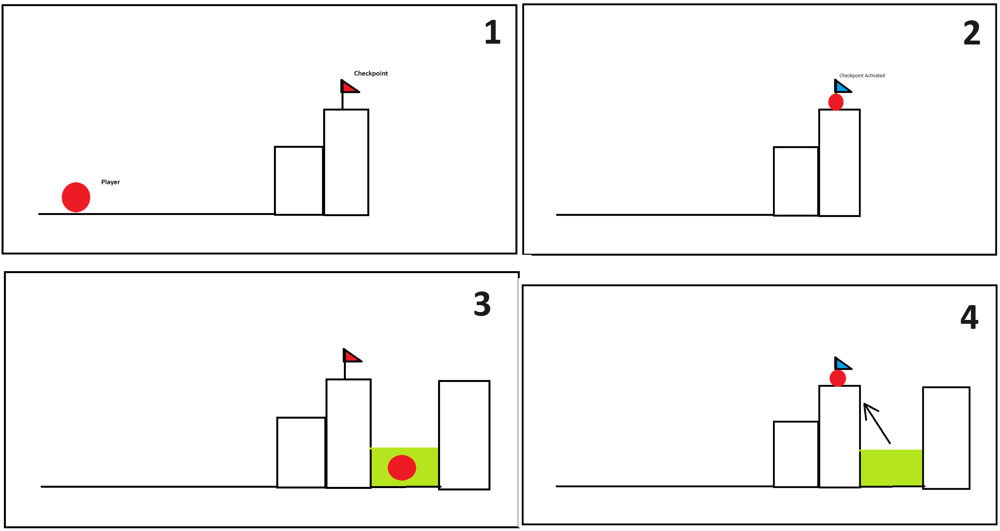
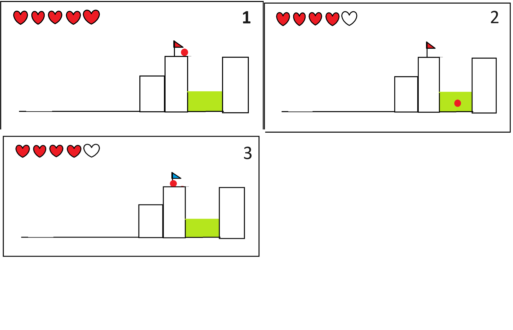
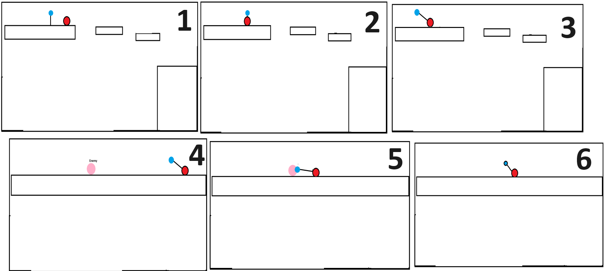
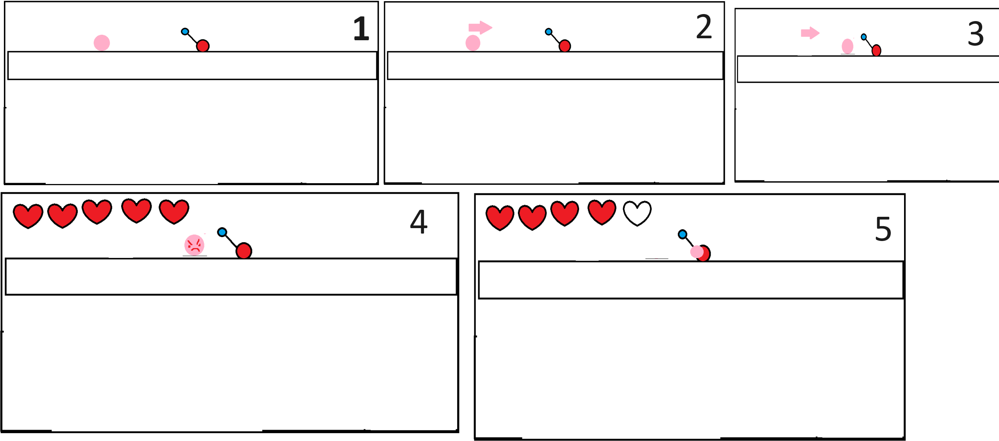
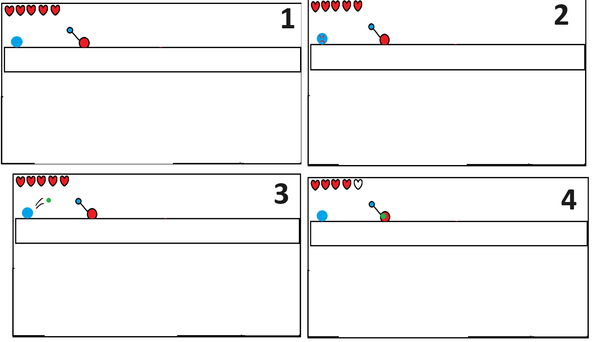
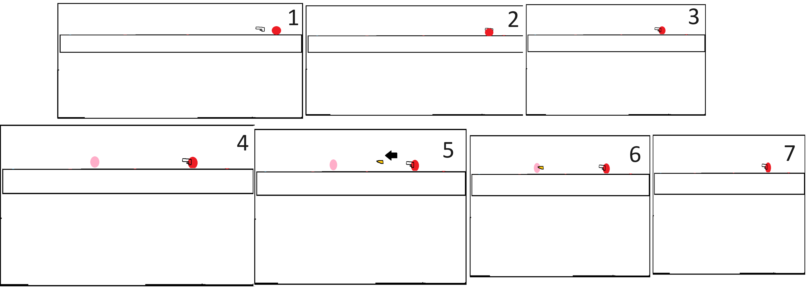
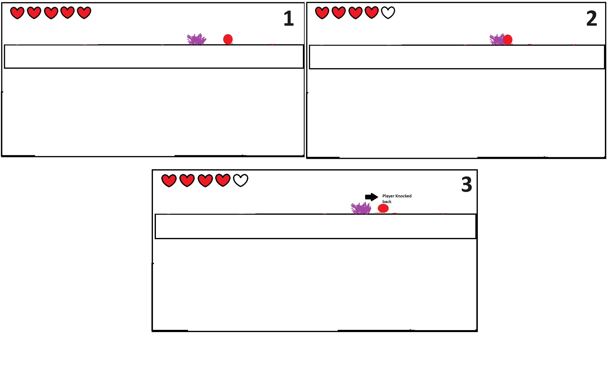
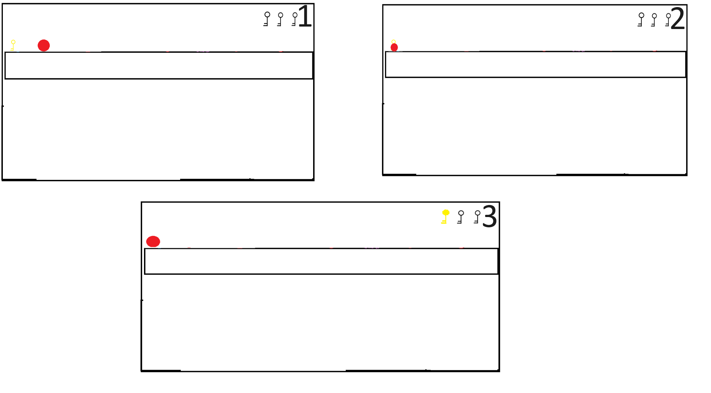

# COMP2150  - Level Design Document
### Name: [Stephen Tsai]
### Student number: [47733284] 

## 1. Player Experience (~700 words)

### 1.1. Discovery
My level facilitates discovery through my use of developing verbs. When the player starts the level he is greeted by a small ledge with a much bigger ledge right after, this design isolates the jump mechanic and allows the player to get familiar with how they can manipulate the height of their jump. The first ledge is reachable through the player tapping the space bar, whilst the second ledge requires the player to hold the space bar. After this my level incorporates an easy platforming section to help the player practice the jump mechanic before introducing the staff. This small section at the start ensures that the player can build off the most simple yet important mechanic of a standard platformer whilst also introducing moving platforms to teach the player what to expect later on in terms of jumping. After that the player is introduced to the staff and the gun, my level allows the player to try out both weapons by introducing two types of enemies one ranged one melee. Lastly to finish off the first section there is one of three keys that the player can collect and as such will introduce the player to the core mechanics and goal of the game. From then on the level incorporates combinations of these mechanics in order to create situations in which the player will need to think out of the box in order to get past certain gaps or doors. For example there's a hole that requires the player to mix the jump and the attack mechanic in order to gain enough distance to cross the gap as just jumping is impossible. Thus building relationships between the mechanics, furthermore to finish off the five steps in developing your verbs my level has a section in which the player must jump precisely across a series of one pixel wide towers thus developing nuanced control.

### 1.2. Drama
My level starts off quite relaxing and tame at the start in order to help the player ease into the unfamiliarity of the game and to allow me to build tension. Furthermore, whenever my game has a section that would be considered "hard" it's followed up by a section that is more relaxing and easy in order to ensure that the player also feels a sense of relief as opposed to just tension. Specifically moments like one of the platforming sections in my level in which you must cross numerous gaps whilst being shot at. This would invoke the feeling of tension whilst the next section (a part thats still difficult but not as stressful due to the lack of an enemy shooting at you) would give the player some relief.

### 1.3. Challenge
The main type of challenge in my level is physical skill with a bit of perceptive skill. I've designed my level to contain sections in which there is a much higher need for physical skill in contrast to the rest of the game, by having this contrast I keep players in the flow channel as the level isn't too easy or too hard. Furthermore the occasional puzzle in my level helps keep the level fresh and as such stimulates the player nad further helps maintain the state of flow. Furthermore my level despite allowing the player to choose if they want to do section 2 or section 3 first still provides a clear objective so that the player doesn't lose interest from not knowing what to do/where to go.

### 1.4. Exploration
My level facilitates autonomy through the different ways that the player could solve puzzles/go through the level, it allows the players the players to go throught the level how they want to which in turn leads to exploration. Furthermore the layout of my level has paths that lead to areas however the areas are cut off from the cameras view so it would require the player to explore these paths in order to see what they lead to. Alongside this, my level also has a little easter egg in which the player can easily find if they decide to explore a little bit, thus in a larger scale game, would motivate the player to explore me and go off the "intended" path. Lastly I used a boss encounter which once again in future levels could be used to guard collectibles (in this instance its just used to guard a key) which would further prompt the player to explore.

## 2. Core Gameplay (~400 words)
A section on Core Gameplay, where storyboards are used to outline how you introduce the player to each of the required gameplay elements in the first section of the game. Storyboards should follow the format provided in lectures.

Storyboards can be combined when multiple mechanics are introduced within a single encounter. Each section should include a sentence or two to briefly justify why you chose to introduce the mechanic/s to the player in that sequence.

You should restructure the headings below to match the order they appear in your level.

### 2.1. Checkpoints

I chose to introduce the checkpoints first as I felt that it would be important for the player to understand what would happen if they were to die or fall into acid and for the player to actually know off the bat if the game was going to have checkpoints or not. Furthermore I wanted the player to be familiar with how the checkpoint mechanics work e.g. how to activate a checkpoint.
### 2.2. Acid

Next I chose to introduce Acid right after the checkpoint as it would show the player the interaction between the acid and the checkpoint (player falls into acid, player respawns at the checkpoint). It also introduces the player to the hazards in the level and shows the player the consequence of touching said hazard (1 life point)
### 2.3. MovingPlatforms

After I chose to incorporate moving platforms as the start of my level showcased the different jump heights so I wanted to further advance the jump mechanic to show that players would be expected to jump onto moving platforms as well as the normal still platforms. This also let me introduce the idea of a moving platform in order to cover gaps that were too far apart.
### 2.4. Health Pickups

Next I introduced the health pickup because it was right after the acid section which meant that once players had gotten past it they would be able to heal once in case they took any damage from the acid. This also helped show the player how much they'd earn from walking over a health pickup.
### 2.5. Passthrough Platform

After that I chose to introduce the Passthrough Platforms as I felt it wasn't as core of a mechanic as the first 4 but rather an extension towards the jump action. At this point of the level, the player should've been completely familiar with the jump mechanic, this added extension would help players understand the different types of platforms.
### 2.6. Weapon Pickup (Staff)

Then I chose to introduce the staff after all the other mechanics as I thought it'd be best for the player to familiarise themselves with moment first before moving onto the attack action.
### 2.7. Chompers

I chose to add chompers after the staff to allow the player to practice their newly acquired weapon, this also let players understand how strong the chompers were and how to modify their playstyle to counter the chompers.
### 2.8. Spitters

I chose to add spitters after chompers as I believed range would be more difficult to deal with as opposed to melee, this would help teach players proper distancing and to show a new type of enemy that players would have to be wary of.
### 2.9. Weapon Pickup (Gun)

After that I added the gun to give players a counter towards the ranged enemies and as I believed the gun was easier to use and less penalising, I wanted the player to first experience the staff before giving them the gun.
### 2.10. Spikes

After the gun I added spikes to finally show the last hazard that was in the level and also to introduce the player to another hazard so that they wouldn't get bored of being introduced to only enemies. Hence why I chose to introduce the spikes at the end rather than during the initial movement mechanics.
### 2.11. Keys

Lastly the key was introduced to show that the key is a reward, I wanted the player to understand that keys would be given throughout the level as rewards. So in this instance it was a reward for completing the first section/tutorial of the game.
## 3. Spatiotemporal Design
A section on Spatiotemporal Design, which includes your molecule diagram and annotated level maps (one for each main section of your level). These diagrams may be made digitally or by hand, but must not be created from screenshots of your game. The annotated level maps should show the structure you intend to build, included game elements, and the path the player is expected to take through the level. Examples of these diagrams are included in the level design lectures.

No additional words are necessary for this section (any words should only be within your images/diagrams).
 
### 3.1. Molecule Diagram

### 3.2. Level Map – Section 1

### 3.3.	Level Map – Section 2

### 3.4.	Level Map – Section 3

## 4. Iterative Design (~400 words)
Iterative design was highly practical and advantageous throughout the design process for my level. Through the use of iterative design in particular grey-boxing I was firstly able to create a layout that I desired through constantly testing the spacing between areas etc. This meant that I was able to easily change experiences in my level in order to target more of those player experience factors. Furthermore iterative design helped me pick ideal places for pickups and enemies and it allowed me to decide whether checkpoints were needed in certain areas. As such, it allowed me to control the challenge of the level through the appropriate placement of these structures to ensure that the level wasn't too difficult or too easy. For example if a section was tricky the process of iterative design helped me determine whether a checkpoint would have been appropriate for that section. In particular, during the testing I was able to discover certain ledges that might've been too high up thus leading to a soft-lock if the player were to fall into the pit. Another example in which iterative design helped was during my boss fight section. Through constantly playing this section it allowed me to determine a suitable range to set my enemies attacks to and a suitable health pool for the enemies, thus allowing me to create a more engaging bossfight that stimulates the player's reactions and physical skill. However I believe an aspect that my level could improve on is the exploration of the level. Through iterative design I noticed that although my level did have sections to allow the player to explore and find things, it would have been a lot more enjoyable if my puzzles required more exploration. Iterative design also allowed me to see that health pickups could be placed in more unique locations rather than just at the end of a section which would have further improved the exploration aspect of my level. 

As shown in my images provided of grey-boxing, the width and distance between ground was a factor that iterative design really helped me nail in my level. For example in certain areas I extended platforms by one pixel just to allow more space for the player, furthermore, moving platforms were also added for sections that might've been a bit too far apart. It was however through grey-boxing that I was able to make these small changes that would have significantly impacted the player's experience in my level. Thus showing that iterative design helped improve my level through many small changes that could have only been done through actually testing the game.

Reflect on how iterative design helped to improve your level. Additional prototypes and design artefacts should be included to demonstrate that you followed an iterative design process (e.g. pictures of paper prototypes, early grey-boxed maps, additional storyboards of later gameplay sequences, etc.). You can also use this section to justify design changes made in Unity after you drew your level design maps shown in section 3. 

You should conclude by highlighting a specific example of an encounter, or another aspect of your level design, that could be improved through further iterative design.

## Generative AI Use Acknowledgement

Use the below table to indicate any Generative AI or writing assistance tools used in creating your document. Please be honest and thorough in your reporting, as this will allow us to give you the marks you have earnt. Place any drafts or other evidence inside this repository. This form and related evidence do not count to your word count.
An example has been included. Please replace this with any actual tools, and add more as necessary.

### Tool Used: ChatGPT
**Nature of Use** Finding relevant design theory.

**Evidence Attached?** Screenshot of ChatGPT conversation included in the folder "GenAI" in this repo.

**Additional Notes:** I used ChatGPT to try and find some more relevant design theory that I could apply to my game. After googling them, however, I found most of them were inaccurate, and some didn't exist. One theory mentioned, however, was useful, and I've incorporated it into my work.

### Tool Used: Example
**Nature of Use** Example Text

**Evidence Attached?** Example Text

**Additional Notes:** Example Text

